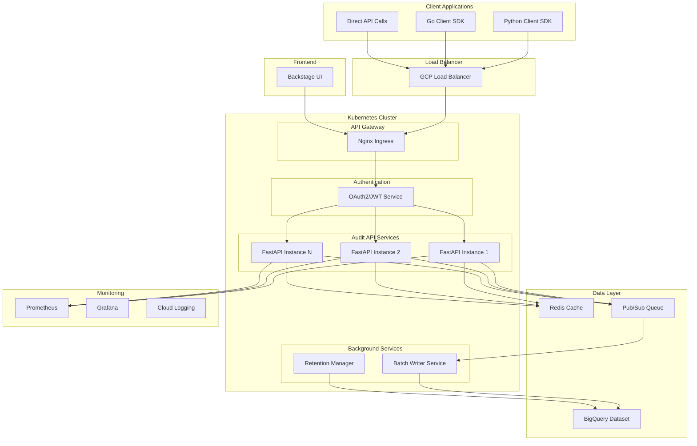

# High-Transaction Audit Log Framework Architecture

## System Overview

A scalable audit log framework designed to handle 1M+ transactions per day, built on Google Cloud Platform with BigQuery as the primary data store.

## Architecture Components



## Data Model

### Core Audit Log Schema

```json
{
  "audit_id": "string (UUID)",
  "timestamp": "timestamp",
  "event_type": "string",
  "user_id": "string",
  "session_id": "string",
  "ip_address": "string",
  "user_agent": "string",
  "resource_type": "string",
  "resource_id": "string",
  "action": "string",
  "status": "string",
  "request_data": "json",
  "response_data": "json",
  "metadata": "json",
  "tenant_id": "string",
  "service_name": "string",
  "correlation_id": "string",
  "retention_period_days": "integer",
  "created_at": "timestamp",
  "partition_date": "date"
}
```

### BigQuery Table Structure

- **Partitioned by**: `partition_date` (daily partitions)
- **Clustered by**: `tenant_id`, `user_id`, `event_type`, `timestamp`
- **Retention**: Configurable per record via `retention_period_days`

## API Design

### Write Operations
- `POST /api/v1/audit/events` - Single event ingestion
- `POST /api/v1/audit/events/batch` - Batch event ingestion (up to 1000 events)

### Read Operations
- `GET /api/v1/audit/events` - Query events with filters
- `GET /api/v1/audit/events/{audit_id}` - Get specific event
- `GET /api/v1/audit/events/export` - Export events (CSV/JSON)

### Query Filters
- Time range (start_time, end_time)
- User ID
- Event type
- Resource type/ID
- Action
- Status
- Tenant ID
- Service name
- Correlation ID
- Custom metadata fields

### Authentication & Authorization

#### Roles
- **audit_reader**: Read access to own tenant's audit logs
- **audit_admin**: Full read access across tenants
- **audit_writer**: Write access for audit events
- **audit_export**: Export capabilities
- **system_admin**: Full system access

#### JWT Claims
```json
{
  "sub": "user_id",
  "tenant_id": "tenant_123",
  "roles": ["audit_reader", "audit_writer"],
  "permissions": ["read:audit", "write:audit"],
  "exp": 1234567890
}
```

## Performance Considerations

### Write Performance
- Async batch processing via Pub/Sub
- Connection pooling for BigQuery
- Write buffering and batching
- Horizontal scaling of API instances

### Read Performance
- Redis caching for frequent queries
- BigQuery query optimization
- Pagination for large result sets
- Query result caching

### Scalability Targets
- **Write throughput**: 1M+ events/day (12+ events/second)
- **Read latency**: <500ms for cached queries, <2s for complex queries
- **Availability**: 99.9% uptime
- **Data retention**: Configurable per event (90 days to 7 years)

## Technology Stack

### Backend
- **API Framework**: FastAPI (Python 3.11+)
- **Database**: Google BigQuery
- **Cache**: Redis
- **Message Queue**: Google Pub/Sub
- **Authentication**: OAuth2 + JWT
- **Async Runtime**: asyncio + uvicorn

### Frontend
- **Framework**: Backstage.io
- **UI Library**: Material-UI v5
- **Styling**: Tailwind CSS
- **State Management**: React Query
- **Build Tool**: Vite

### Infrastructure
- **Container Runtime**: Docker
- **Orchestration**: Kubernetes (GKE)
- **Load Balancer**: GCP Load Balancer
- **Monitoring**: Prometheus + Grafana
- **Logging**: Google Cloud Logging

### Client SDKs
- **Python SDK**: Built with httpx (async support)
- **Go SDK**: Built with net/http
- **Code Generation**: OpenAPI Generator

## Security Considerations

### Data Protection
- Encryption at rest (BigQuery native)
- Encryption in transit (TLS 1.3)
- PII data masking/hashing
- Audit log integrity verification

### Access Control
- Multi-tenant isolation
- Role-based access control (RBAC)
- API rate limiting
- IP whitelisting support

### Compliance
- GDPR compliance (data deletion)
- SOX compliance (immutable logs)
- HIPAA compliance (data encryption)
- Audit trail for audit system itself

## Deployment Architecture

### Kubernetes Resources
- **Deployments**: API services, background workers
- **Services**: Load balancing and service discovery
- **ConfigMaps**: Configuration management
- **Secrets**: Sensitive data (JWT keys, DB credentials)
- **HPA**: Horizontal Pod Autoscaler
- **Ingress**: External traffic routing

### Environment Strategy
- **Development**: Single-node cluster, in-memory cache
- **Staging**: Multi-node cluster, shared BigQuery dataset
- **Production**: Multi-zone cluster, dedicated BigQuery dataset

## Monitoring & Observability

### Metrics
- Request rate, latency, error rate
- BigQuery query performance
- Cache hit/miss ratios
- Queue depth and processing time

### Logging
- Structured JSON logging
- Correlation ID tracking
- Error tracking and alerting
- Performance profiling

### Health Checks
- API endpoint health
- Database connectivity
- Cache availability
- Queue processing status